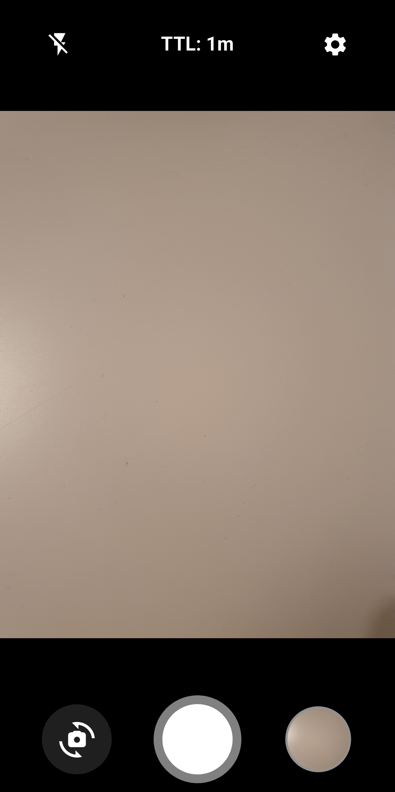
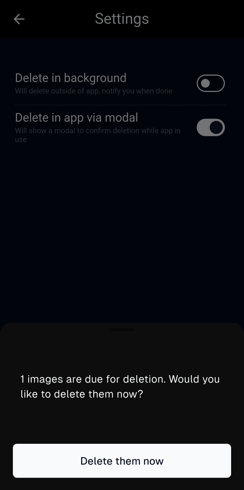

 

<h1 align="center">TTL Camera</h1>

 

  
  
   
  
  
    
  

<h4 align="center">TTL Camera is a temporary camera app that allows you to take pictures, set a time to live (TTL) for each photo, and choose whether deletion occurs in the background or within the app.</h4>

# Download

  - No personal data collected by the app

    
    
    

# Features

- Take pictures
- Set a time to live (TTL) for each photo
- Choose whether deletion occurs in the background or within the app
- Simple, clean UX
- Smooth animations
- Customizable settings

- 

Free and Source Available

  - No proprietary blobs/dependencies
  - Releases generated by GitHub actions, guaranteeing it matches the source code

- 

Privacy-friendly

  - No personal data collected by the app
  - No trackers/automatic crash reporters

# License

* This project is fully copyrighted by the author and is not open source.
* No rights are granted to use, modify, or distribute the source code without explicit permission from the author.
* Misrepresentation of the origin of the material is prohibited.
